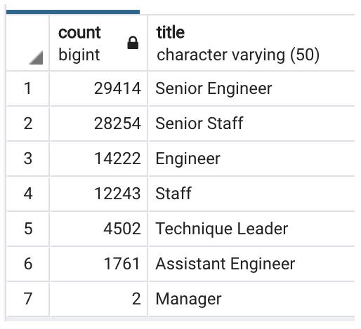
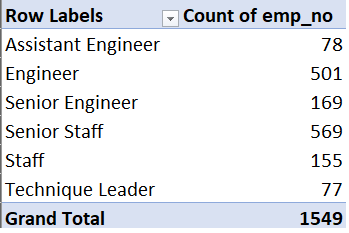

# Pewlett-Hackard-Analysis

## Overview of the analysis

The goal of this project is to help Bobby and PH determine the number of retiring employees per title, and identify employees who are eligible to participate in a mentorship program.

## Results

### Analysis 1

1. The titles of the most retiring employees are Senior Engineer and Senior Staff.
2. The number of senior employees who are going to retire is larger than that of the employees who are in more junior positions.
3. Two managers are retiring soon, which is important to note. The company should seek for replcement.
4. Assistant engineer is the title of which the fewest employees are going to retire. It's very likely that these employees are younger in age.

### Analysis 2

1. Only 1549 employees are eligible for the mentorship program.
2. Most employees that are eligible for the mentorship program are Engineers and Senior Staff.
3. Assistant engineers and technique leaders who are probably younger in age are the smallest groups eligible for the mentorship program.
4. Senior engineers that are eligible for the mentorship program are fewer than senior staff despite the numbers of retiring employees in both positions are close.

## Summary

- How many roles will need to be filled as the "silver tsunami" begins to make an impact?
  In totl, 90398 positions need to be filled.
- Are there enough qualified, retirement-ready employees in the departments to mentor the next generation of Pewlett Hackard employees?
  There are probably not enough qualified, retirement-ready employees in the departments to mentor the next generation of Pewlett Hackard employees as only 1549 employees are eligible for the mentorship program.
